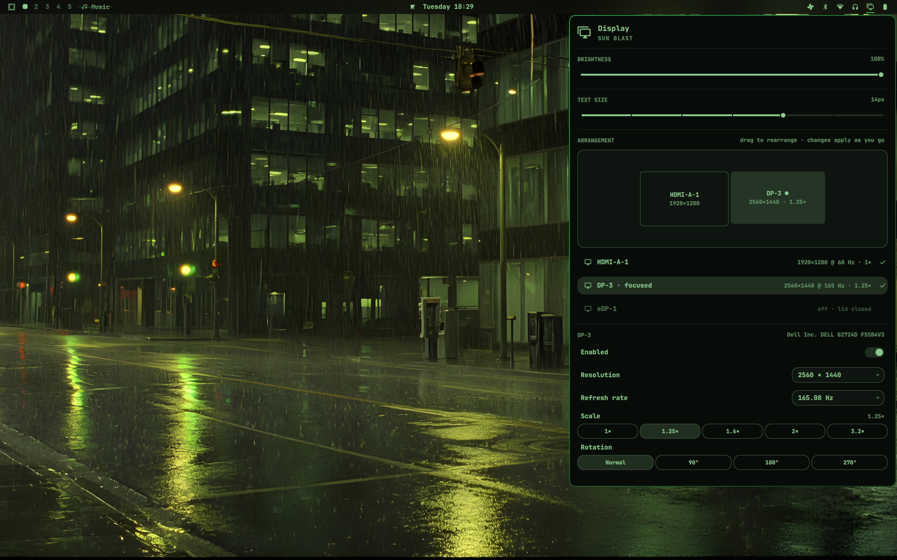
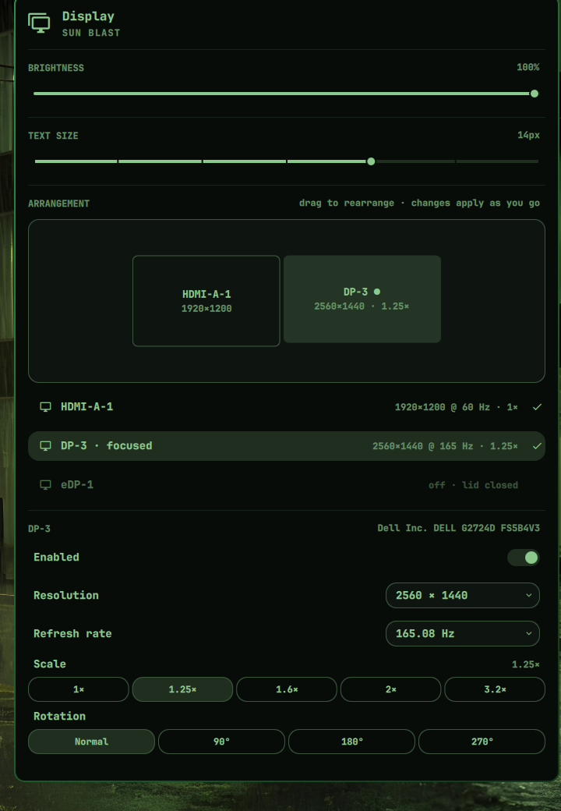

# Omamonitor

[](https://omarchy.org)
[](https://wiki.hypr.land/Configuring/Basics/Monitors/)
[](LICENSE)

A Display panel for the [Omarchy](https://omarchy.org) shell with a
drag-and-drop monitor arrangement editor. Drag your monitors into place,
pick a resolution, refresh rate, scale or rotation, and the change lands on
your running Hyprland session right away and is saved to
`~/.config/hypr/monitors.lua` so it survives a reboot. No config editing,
no apply button.

It replaces the stock Display widget in the bar and keeps everything that
widget already does: the brightness slider and the text size slider.



## Features

- **Drag-and-drop arrangement.** A scaled map of your monitors in
  Hyprland's logical coordinates. Drop a monitor on whichever side of its
  neighbour you want it, and it snaps flush and aligned. Layouts never end
  up with gaps or overlaps, so the pointer can always cross between screens.
- **Per-monitor settings.** Resolution and refresh rate from the modes the
  monitor actually reports, scale presets limited to values Hyprland accepts
  for that mode, and rotation in 90° steps.
- **Applies as you go.** Every change is pushed live with `hyprctl eval`
  and written to `monitors.lua` in one step. Quick successive changes are
  coalesced.
- **Connected displays come on by themselves.** Plug in a monitor and it is
  enabled and placed to the right of the layout, whether or not the panel
  is open. Switch one off in the panel and it stays off until you switch it
  back on.
- **Plays nicely with the lid.** On a laptop, the internal panel is left to
  Omarchy's own clamshell handling: it stays off while the lid is closed and
  comes back where it was once the lid opens.
- **Keyboard first, like the rest of Omarchy.** `j`/`k` walk the rows,
  `h`/`l` move across presets or cycle resolutions and refresh rates, `Enter`
  selects, toggles or opens a list, `Esc` closes.



## Install

```bash
omarchy plugin add https://github.com/andreinita21/omamonitor.git --enable
```

Omamonitor takes the place of the built-in Display widget (`omarchy.monitor`)
in your bar. Updates arrive with `omarchy plugin update`, like any other
git-managed plugin.

To remove it and get the stock widget back:

```bash
omarchy plugin remove andreinita21.omamonitor
```

### Requirements

- Omarchy 4.0 or newer, running Hyprland with the Lua configuration
  (`~/.config/hypr/monitors.lua`).
- `jq` and `python3`, both part of a standard Omarchy install.

## Using it

Click the display icon in the bar, or summon the panel from a keybinding
through the stock IPC target:

```bash
omarchy-shell omarchy.monitor toggle
```

Inside the panel:

| Action | Mouse | Keyboard |
| --- | --- | --- |
| Select a monitor | click its tile or its row | `j`/`k` to the row, `Enter` |
| Move a monitor | drag its tile | — |
| Turn a monitor on or off | click the Enabled row | `Enter` on the Enabled row |
| Resolution / refresh rate | open the dropdown | `h`/`l` to cycle, `Enter` to open the list |
| Scale / rotation | click a preset | `h`/`l`, then `Enter` |
| Brightness / text size | drag the slider | `h`/`l` on the row |

The panel header shows `APPLYING…` while a change is in flight and
`APPLY FAILED` with Hyprland's message if one is rejected.

## What it writes

Omamonitor owns `~/.config/hypr/monitors.lua`. After every change it
regenerates the whole file, so hand edits made there are replaced. A
generated file looks like this:

```lua
local omarchy_gdk_scale = 1

hl.env("GDK_SCALE", tostring(omarchy_gdk_scale))

-- Any monitor not listed below (one plugged in later) gets sane defaults.
hl.monitor({ output = "", mode = "preferred", position = "auto", scale = "auto" })

-- Dell Inc. DELL U2412M 0FFXD46G5CHS
hl.monitor({ output = "HDMI-A-1", mode = "1920x1200@59.95", position = "0x0", scale = 1, transform = 0 })

-- Dell Inc. DELL G2724D FS5B4V3
hl.monitor({ output = "DP-3", mode = "2560x1440@165.08", position = "1920x0", scale = 1.25, transform = 0 })
```

A monitor you switched off is written as
`hl.monitor({ output = "...", disabled = true })`, which is also how the
panel knows not to switch it back on. The `GDK_SCALE` value already in the
file is preserved.

A laptop panel held off by the lid keeps whatever rule it had, so opening
the lid brings it back to its previous position and scale.

## How it works

| File | Role |
| --- | --- |
| `Panel.qml` | The bar widget and panel: canvas, controls, keyboard cursor model, apply pipeline |
| `Model.js` | Pure layout logic: parsing `hyprctl monitors all -j`, snapping and placement, mode and scale lists, Lua generation |
| `display-state.sh` | Reads the monitor list, lid state, clamshell state and the outputs pinned off in `monitors.lua` |
| `write-monitors.py` | Validates the layout and rewrites `monitors.lua` atomically |

Changes are applied with `hyprctl eval` and `hl.monitor()` calls rather than
`hyprctl keyword`, which Hyprland's Lua config mode does not accept.

## License

[MIT](LICENSE)
