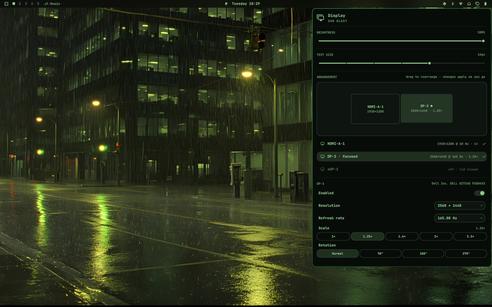
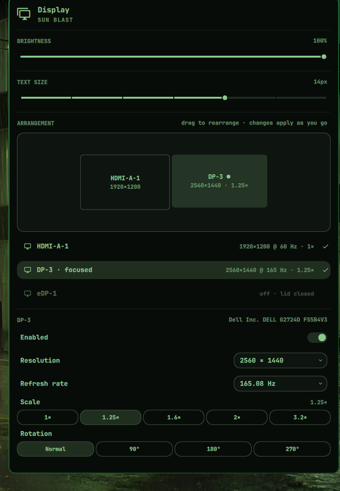

# Omamonitor

[](https://omarchy.org)
[](https://wiki.hypr.land/Configuring/Basics/Monitors/)
[](LICENSE)

A Display panel for the [Omarchy](https://omarchy.org) shell with a
drag-and-drop monitor arrangement editor. Drag your monitors into place,
pick a resolution, refresh rate, scale or rotation, and the change lands on
your running Hyprland session right away and is saved to
`~/.config/hypr/monitors.lua` so it survives a reboot. No config editing,
no apply button. It can also give each open app its own scale, so a
monitor can stay at 1× while Chrome or your terminal renders at 1.25×.

It replaces the stock Display widget in the bar and keeps everything that
widget already does: the brightness slider and the text size slider.



## Features

- **Drag-and-drop arrangement.** A scaled map of your monitors in
  Hyprland's logical coordinates. Drop a monitor on whichever side of its
  neighbour you want it, and it snaps flush and aligned. Layouts never end
  up with gaps or overlaps, so the pointer can always cross between screens.
- **Per-monitor settings.** Resolution and refresh rate from the modes the
  monitor actually reports, scale presets limited to values Hyprland accepts
  for that mode, and rotation in 90° steps.
- **Keeps custom modes.** A mode the monitor does not advertise (for example
  3440x1440 on an ultrawide whose HDMI EDID only lists 16:9 modes, set by
  hand once) is written as a CVT reduced-blanking `modeline`, so arranging
  monitors or reloading Hyprland does not drop it back to the preferred mode.
- **Per-app scaling.** Every app with an open window gets a row with
  Auto, 1×, 1.1×, 1.25×, 1.5×, 1.75× and 2×. Hyprland scales whole
  monitors, not single windows, so the factor is applied through the app's
  own toolkit: open foot windows resize on the spot, and other apps get a
  one-click relaunch. See [Per-app scaling](#per-app-scaling).
- **Applies as you go.** Every change is pushed live with `hyprctl eval`
  and written to `monitors.lua` in one step. Quick successive changes are
  coalesced.
- **Connected displays come on by themselves.** Plug in a monitor and it is
  enabled and placed to the right of the layout, whether or not the panel
  is open. Switch one off in the panel and it stays off until you switch it
  back on.
- **Plays nicely with the lid.** On a laptop, the internal panel is left to
  Omarchy's own clamshell handling: it stays off while the lid is closed and
  comes back where it was once the lid opens.
- **Keyboard first, like the rest of Omarchy.** `j`/`k` walk the rows,
  `h`/`l` move across presets or cycle resolutions and refresh rates, `Enter`
  selects, toggles or opens a list, `Esc` closes.



## Install

```bash
omarchy plugin add https://github.com/andreinita21/omamonitor.git --enable
```

Omamonitor takes the place of the built-in Display widget (`omarchy.monitor`)
in your bar. Updates arrive with `omarchy plugin update`, like any other
git-managed plugin.

To remove it and get the stock widget back:

```bash
omarchy plugin remove andreinita21.omamonitor
```

### Requirements

- Omarchy 4.0 or newer, running Hyprland with the Lua configuration
  (`~/.config/hypr/monitors.lua`).
- `jq` and `python3`, both part of a standard Omarchy install.

## Using it

Click the display icon in the bar, or summon the panel from a keybinding
through the stock IPC target:

```bash
omarchy-shell omarchy.monitor toggle
```

Inside the panel:

| Action | Mouse | Keyboard |
| --- | --- | --- |
| Select a monitor | click its tile or its row | `j`/`k` to the row, `Enter` |
| Move a monitor | drag its tile | — |
| Turn a monitor on or off | click the Enabled row | `Enter` on the Enabled row |
| Resolution / refresh rate | open the dropdown | `h`/`l` to cycle, `Enter` to open the list |
| Scale / rotation | click a preset | `h`/`l`, then `Enter` |
| Brightness / text size | drag the slider | `h`/`l` on the row |
| App scale | click a preset | `h`/`l` on the app's row, then `Enter` |

The panel header shows `APPLYING…` while a change is in flight and
`APPLY FAILED` with Hyprland's message if one is rejected.

## Per-app scaling

Hyprland has no per-window scale: every window on a monitor is drawn at
that monitor's factor. So the App scaling section asks each app to scale
itself, using whatever its toolkit offers. It lists every app with an open
window, the installed Chromium-based browsers, and any app you already gave
a factor, even while it is closed.

| App | How the factor is applied |
| --- | --- |
| Chromium, Google Chrome, Brave, Brave Origin, Edge | `--force-device-scale-factor` in the browser's `~/.config/<name>-flags.conf` |
| Electron apps (Discord, VS Code, Obsidian, …) | `--force-device-scale-factor` on the command line |
| Qt 5 / Qt 6 apps | `QT_SCALE_FACTOR` |
| GTK 3 apps | `GDK_DPI_SCALE`, which scales text only |
| foot, Alacritty, kitty, Ghostty | the font size from the terminal's config, times the factor |
| GTK 4 apps (Files, …) | not possible: GTK 4 has no per-app scale, so the row is greyed out |

Browsers keep the setting in their flags file because Omarchy launches them
by the first word of their desktop entry. Every other app gets a desktop
entry override in `~/.local/share/applications` whose `Exec` lines start
with `omamonitor-scale-run`, a small wrapper installed in `~/.local/bin`:

```ini
[Desktop Entry]
X-Omamonitor-Scale=1.25
X-Omamonitor-Created=true
Exec=omamonitor-scale-run --scale=1.25 --kind=qt kdenlive %F
```

The Omarchy app launcher, `xdg-terminal-exec` (Super+Return) and anything
else that starts apps from their desktop entry go through the override. A
command started some other way, such as a keybinding that runs `foot`
directly, needs the wrapper in front of it:

```lua
launch = "omamonitor-scale-run --scale=1.25 --kind=foot foot"
```

Choosing **Auto** takes the factor away again: the switch is removed from a
flags file, an override Omamonitor created is deleted, and one you already
had is put back to its old `Exec` lines.

What a factor means depends on how the app talks to the display:

- **Wayland**: the factor multiplies the monitor's scale. An app at 1.25×
  is 1.25× on a 1× monitor and 1.5625× on a 1.25× monitor. With no factor,
  Chromium follows the monitor scale times GNOME's text scaling factor,
  which the Text size slider sets.
- **XWayland** (for example `--ozone-platform=x11` in a browser's flags
  file): Omarchy turns Hyprland's XWayland scaling off, so the factor is
  the app's whole scale and it looks the same size on every monitor. The
  row says so.

### Live changes and relaunching

A monitor's scale changes live because Hyprland tells every app about it
through the Wayland protocol and the apps redraw. There is no such message
for one app's own factor, and the switches above (environment variables,
command-line flags) are only read when an app starts. So:

- **foot follows live.** Omamonitor sends foot's own zoom keys to every open
  foot window (`Ctrl+0`, then `Ctrl+=` or `Ctrl+-` the right number of
  times) through Hyprland, without focusing it. Zoom moves in foot's
  `font-size-adjustment` steps (0.5 pt unless foot.ini sets another), so
  the result is the closest step to the factor. It also resets any zoom you
  had in those windows.
- **Other apps relaunch with one click.** While an open window still runs at
  the old factor, the row says `relaunch to apply` and shows a 󰑓 button.
  It closes the app's windows one at a time, the way you would, and starts
  it again from its desktop entry. If a window stays open (an app asking to
  save its work), it stops and tells you instead of killing anything. An
  app that keeps running in the tray after its windows close is asked to
  quit. Browsers are asked to quit as a whole and come back with
  `--restore-last-session`, so tabs and windows return.
- **Other terminals** (Alacritty, kitty, Ghostty) are never relaunched,
  since that would end whatever runs inside them; new windows get the
  factor.

From a keybinding or a script, the same change goes through IPC, using the
browser name or the app's desktop entry id:

```bash
omarchy-shell omarchy.monitor appScale chromium 1.25
omarchy-shell omarchy.monitor appScale foot auto
omarchy-shell omarchy.monitor appRelaunch chromium
```

## What it writes

Omamonitor owns `~/.config/hypr/monitors.lua`. After every change it
regenerates the whole file, so hand edits made there are replaced. A
generated file looks like this:

```lua
local omarchy_gdk_scale = 1

hl.env("GDK_SCALE", tostring(omarchy_gdk_scale))

-- Any monitor not listed below (one plugged in later) gets sane defaults.
hl.monitor({ output = "", mode = "preferred", position = "auto", scale = "auto" })

-- Dell Inc. DELL U2412M 0FFXD46G5CHS
hl.monitor({ output = "HDMI-A-1", mode = "1920x1200@59.95", position = "0x0", scale = 1, transform = 0 })

-- Dell Inc. DELL G2724D FS5B4V3
hl.monitor({ output = "DP-3", mode = "2560x1440@165.08", position = "1920x0", scale = 1.25, transform = 0 })
```

A monitor you switched off is written as
`hl.monitor({ output = "...", disabled = true })`, which is also how the
panel knows not to switch it back on. The `GDK_SCALE` value already in the
file is preserved.

A laptop panel held off by the lid keeps whatever rule it had, so opening
the lid brings it back to its previous position and scale.

App scaling writes only the `--force-device-scale-factor` line of a
browser's flags file, and only the `Exec` lines and `X-Omamonitor-*` keys
of a desktop entry. Files that are symlinks (a dotfiles setup, for
example) are updated in place. Which foot windows were resized live is kept in
`$XDG_RUNTIME_DIR/omamonitor-live.json`, which goes away on logout.

## How it works

| File | Role |
| --- | --- |
| `Panel.qml` | The bar widget and panel: canvas, controls, keyboard cursor model, apply pipeline |
| `Model.js` | Pure layout logic: parsing `hyprctl monitors all -j`, snapping and placement, mode and scale lists, Lua generation |
| `display-state.sh` | Reads the monitor list, lid state, clamshell state and the outputs pinned off in `monitors.lua` |
| `write-monitors.py` | Validates the layout and rewrites `monitors.lua` atomically |
| `app-scale.py` | Lists the open apps and their toolkits, writes the flags files and desktop entry overrides, resizes open foot windows and relaunches apps |
| `omamonitor-scale-run` | Starts an app at its factor; copied to `~/.local/bin` when first needed |

Changes are applied with `hyprctl eval` and `hl.monitor()` calls rather than
`hyprctl keyword`, which Hyprland's Lua config mode does not accept.

## License

[MIT](LICENSE)
